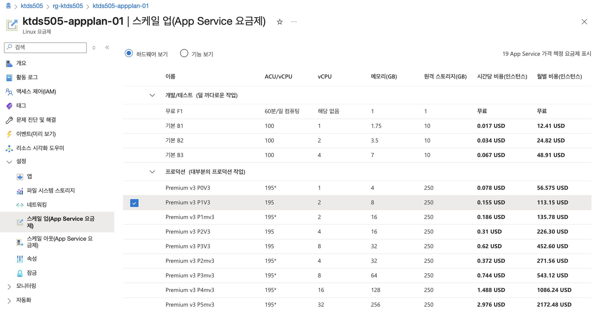

# 🔍 AIRA 이상징후 현황 조회 시스템

MSA 환경에서 모바일 개통 시 발생하는 에러들을 분석하고 해결 방법을 제공하는 AI 기반 지원 시스템입니다.

접속 URL : [ktds505.azurewebsites.net](https://ktds505.azurewebsites.net)

## 📋 주요 기능

- **실시간 에러 검색**: Azure Search를 통한 빠른 에러 정보 검색
- **AI 기반 해결책 제공**: Azure OpenAI를 활용한 맞춤형 해결 방법 제안
- **시스템 상태 모니터링**: 실시간 관련 시스템 상태 확인
- **다양한 개통 유형 지원**: 신규개통, 번호이동, 기기변경 에러 커버
- **직관적인 채팅 인터페이스**: Streamlit 기반의 사용자 친화적 UI
- **Slack Webhook 연동** : 검색 결과를 Slack 채널로 전송

## 처음 생각했던 목표 시스템
- 현재 팀에서 운영중인 모니터링 시스템에 AI Assistant 기능 적용으로 원인 분석 및 조치 시간 단축
- Teams IT상황창에 이상징후가 등록되면 인지하여 해당 시간대 시스템 상황, 외부시스템 연동 현황 등 종합적으로 분석하여 점검 포인트 및 조치 방법 가이드
- 운영자가 조치방법 선택 시 자동 조치 적용 후 Template 기반 결과 보고서 자동 생성

## 삽질의 흔적
### 1. 명령 프롬프트
<details><summary>접기/펼치기</summary>  

너는 ms ai교육을 듣고 있는 개발자야.
교육이 끝나서 mvp프로젝트를 MS-AI-MVP라는 프로젝트 이름으로 진행하려고해.
너는 msa, spring boot, spring cloud gateway로 개발된 모바일 개통 시스템을 운영하고 있고 mvp 시나리오는 아래와 같이 진행하려해

모바일 개통 시스템 개요

- 2025-09-01 ~ 2025-09-30 한달동안 신규개통(KT), 번호이동(SKT, LGU+), 기기변경 등 개통 현황에 대해서 관리한다.
- 주요 기능은 다음과 같다.
    - 단말기 주문 처리 (단말기는 24년 부터 출시된 기종)
    - 결제 처리 (포인트 차감, 결제방법 - 계좌이체, 신용카드, 간편납부 등)
    - 배송 처리 (대리점 직접 수령, 택배발송, 배송일 등)
- 모바일 개통 시스템은 구현하지 않으며, 로그 데이터 생성을 위해 주요 기능을 참고한다.

전제사항

- azure 구독중이고 사용하려는 툴은 langgraph, streamlit, azure search (index, indexer), azure openai, 미세조정, 컨텐츠 필터 등 을 사용해야하고 완성도를 높이기 위해 추가적으로 필요한 툴이 있으면 추가하여 사용가능하다.
- streamlit은 azure 웹앱을 사용해서 생성하고 domain 형태로 접속이 가능해야한다.
- python 가상환경은 uv를 사용하도록 한다.

시나리오 1 - VoC 원인 분석

- 모바일 개통서비스에서 특정 서비스가 안된다고 VoC가 들어온 경우 어떤 문제인지 근본 원인과 해결 방법을정리해서 email로 발송한다.
- email은 gmail을 사용하며 email 주소는 기본적으로 환경설정에 사전 정의를 해놓고 메일 발송 시 환경설정에 정의되어 있는 email주소로 발송할지, 신규 입력을 받을 시 화면에서 선택하여 발송하고, 신규의 경우 채팅창에서 메일 주소를 입력받아 발송한다.
- VoC는 streamlit으로 만든 채팅창에 입력된 내용을 분석해서 연동하고 VoC의 기본 템플릿은 다음과 같다.  

[ 이상징후 공지]
1. 서비스명 : 모바일 개통서비스
2. 발생시간 :
3. 영향도 : 개통 서비스 지연
4. 현상 : 신규 개통 신청 시 서비스 처리 불가 이벤트 발생

시나리오 2 - 시스템 사용 현황

- 오늘 날짜(예: 2025-09-15) 모바일 개통 현황이라는 제목으로 접속자수, 주문건수, API별 호출 건수, 리소스 사용률 등 현재 시스템 현황에 대해서 일단위 정기 리포트를 생성해서 메일로 발송한다.
- 메일 주소는 시나리오 1과 동일하게 사전에 정의된 주소, 신규 입력 중 선택하여 메일을 발송한다.

시나리오 3 - 모바일 개통 현황

- “단말기 주문 현황” 이라고 입력하면 모바일 개통 서비스의 주문 현황(주문 일자, 주문 유형별 건수 (신규 개통, 번호이동, 기기변경)를 알려주고 메일 발송여부를 확인하여 메일로 발송한다.
- 메일 주소는 시나리오 1과 동일하게 사전에 정의된 주소, 신규 입력 중 선택하여 메일을 발송한다.

vscode로 어떻게 개발하면 좋을 지 작업해야하는 순서를 azure환경에서 리소스 생성부터 자세히 알려주고 저 시스템을 구현하기 위한 소스코드, 소스코드 설명, 로그 데이터 생성해주고 vscode 프로젝트로 다운로드 받을 수 있게 해줘  
구현하면서 명확하지 않은 부분이 있으면 추가로 확인 요청해주고 소스코드는 최대한 심플하고 연관모듈은 필수적으로 사용하는 것만 설치할 수 있게 작성해줘
</details>

### 2. 테스트 데이터 준비
최초 CSV로 테스트 데이터 생성 → parsing 방식이 다름  
테스트 데이터 CSV가 유형별로 다르게 생성되면 각각 다른 index로 생성해야함  
 → index 4개를 묶어서 사용해야하는 현상 발생으로 그냥 JSON으로 다시 생성하기로 함.  
JSON으로 생성 후 테스트 데이터 항목 추가 필요하여 삭제 후 재생성 시 필드 타입 오류 발생  
 → 조교님 도움으로 해결.
 
### 3. App Plan
비용을 아낀다고 너무 저렴한 요금제를 선택하면 배포가 안되는 현상 발생  
→ 최소 premium v3 P1V3 이상 사용

> :( Application Error
>
> If you are the application administrator, you can access the diagnostic resources.



### 4. Code Assistant
코드 어시스턴트를 너무 믿지말자.  
불필요한 소스코드가 너무 많이 추가되어 코드가 복잡해진다.  
방어로직 → 그 로직을 방어하기 위한 방어 로직 → ... 무한 반복.. 헤어나올 수 없음.. ㅠㅠ

### 5. 가장 큰 Lessons Learned
- 시간이 부족할 땐 일단 기동되서 조회 되면 더 이상 수정하지말자...  


---
## MVP 시나리오
1. Teams IT상황창에서 이상 징후를 자동 감지하고, 해당 서버·서비스의 상태 정보를 수집하여 AI 기반 Root Cause 분석 (MVP에서는 Teams 대신 채팅창 입력으로 수행)
2. 에러 현상 설명 및 조치 방법 추천
3. Teams 종합상황창에 조치 방법 공유 (MVP는 Slack으로 대체)

## 주요 화면
검색 화면 예시


검색결과 예시


검색결과 Slack 전송


Slack 채널 메시지 화면


## 💡 사용 방법

1. **에러 문의**: 채팅창에 발생한 문제나 에러 코드를 입력
2. **AI 분석**: 시스템이 자동으로 관련 정보를 검색하고 해결책 제공
3. **시스템 상태 확인**: 왼쪽 사이드바에서 실시간 시스템 상태 모니터링
4. **상세 정보**: 관련된 에러 정보와 단계별 해결 방법 확인

### 예시 질문
- "신규개통 시 본인인증이 안 돼요"
- "MSA-001 에러가 발생했어요"
- "번호이동 중에 오류가 생겼어요"
- "기기변경 후 네트워크 연결이 안돼요"
- "시스템 상태는 어떤가요?"

## 📊 지원 에러 유형 (30건)
<details><summary>접기/펼치기</summary>
### 신규개통 (15건)
- 고객정보 검증 실패 (MSA-001)
- 신용정보 조회 실패 (MSA-009) 
- 중복 가입 방지 오류 (MSA-010)
- 통신비 미납 이력 확인 (MSA-011)
- 가족 관계 확인 실패 (MSA-012)
- 외국인 등록번호 검증 실패 (MSA-013)
- 법인 사업자번호 검증 오류 (MSA-014)
- 미성년자 법정대리인 동의 오류 (MSA-015)
- 요금제 적용 오류 (MSA-004)
- 결제수단 검증 실패 (MSA-006)
- 재고 부족 오류 (MSA-007)
- 네트워크 연동 타임아웃 (MSA-008)
- 서비스 활성화 지연 (MSA-029)
- 고객정보 동기화 실패 (MSA-030)

### 번호이동 (8건)
- 번호 포팅 조회 실패 (MSA-002)
- 포팅 승인번호 만료 (MSA-016)
- 포팅 대상 번호 오류 (MSA-017)
- 포팅 명의자 불일치 (MSA-018)
- 포팅 제한 번호 (MSA-019)
- 기존 통신사 해지 미완료 (MSA-020)
- 동시 포팅 신청 오류 (MSA-021)
- 포팅 수수료 결제 실패 (MSA-022)

### 기기변경 (7건)
- USIM 활성화 실패 (MSA-003)
- 기기 호환성 검증 실패 (MSA-005)
- USIM 카드 불량 (MSA-023)
- 기기 IMEI 등록 실패 (MSA-024)
- 기기 잠금 해제 실패 (MSA-025)
- 기기 소프트웨어 호환성 오류 (MSA-026)
- 데이터 백업 복원 실패 (MSA-027)
- 기기 보안 설정 충돌 (MSA-028)
</details>

## 🖥️ 시스템 상태 모니터링

### 실시간 상태 확인
- **전체 시스템 개수**: 연관된 모든 시스템 수
- **정상 시스템 개수**: 정상 작동 중인 시스템 수
- **상태별 분류**: 정상/지연/오류/부하/점검 상태별 시스템 목록

### 상태 표시 아이콘
- 🟢 정상: 시스템이 정상 작동 중
- 🟡 지연: 응답 시간 지연 발생
- 🟠 오류/부하: 일시적 오류나 높은 부하 상태
- 🔴 점검중: 시스템 점검 또는 서비스 중단

### 모니터링 대상 시스템
- **인증 관련**: 본인인증API, 신용조회시스템, 외국인등록시스템
- **포팅 관련**: 포팅센터API, 통신사포팅서버, 승인관리시스템
- **결제 관련**: 결제게이트웨이, 금융기관API, 카드사시스템
- **네트워크**: HLR서버, 네트워크인증서버, 로드밸런서
- **관리 시스템**: 고객정보DB, 재고관리시스템, 과금시스템

## 🏗️ 아키텍처

```
[사용자] ↔ [Streamlit UI] ↔ [검색 로직] ↔ [Azure Search]
                ↓
         [OpenAI GPT-4o-mini] ← [컨텍스트 구성]
       
       → [Slack]
```

## 🛠️ 시스템 구성

```
ms-ai-mvp/
├── app.py                    # 메인 애플리케이션 (시스템 상태 모니터링 추가)
├── update_data.py            # 데이터 업데이트 스크립트
├── requirements.txt          # Python 패키지 의존성
├── streamlit.sh              # Azure 환경 배포용 Python 패키지 의존성 설치 및 실행 (최초 실행 시 사용)
├── run.sh                    # 로컬에서 Streamlit 실행
├── .env.example              # 환경 변수 템플릿
├── .gitignore                # Git 제외 파일 목록
├── data/
│   └── error_data.json       # 모바일 개통 에러 데이터 (30건, 시스템 상태 포함)
├── test/
│   └── data_test.py          # 테스트 데이터 JSON 포맷 점검
│   └── debug_connection.py   # Azure 연결 테스트
│   └── debug_test.py         # Azure Search 연결 테스트
└── README.md                 # 프로젝트 설명
```


## ⚙️ 설치 및 설정

### 1. Python 환경 확인
- Python 3.13+ 권장
- pip 패키지 매니저 필요

### 2. 프로젝트 설정

```bash
# 저장소 클론 또는 파일 다운로드
git clone https://github.com/lab1202/ms-ai-mvp.git
cd ms-ai-mvp

# 새 가상환경 생성
python3 -m venv venv
source venv/bin/activate

# 환경 변수 파일 생성
cp .env.example .env
# .env 파일을 열어서 Azure 리소스 정보 입력
```bash
# Azure OpenAI 설정
AZURE_OPENAI_ENDPOINT=https://your-openai-resource.openai.azure.com/
AZURE_OPENAI_API_KEY=your-api-key-here
AZURE_OPENAI_DEPLOYMENT_NAME=
AZURE_OPENAI_API_VERSION=

# Azure Search 설정
AZURE_SEARCH_SERVICE_ENDPOINT=https://your-search-service.search.windows.net
AZURE_SEARCH_ADMIN_KEY=your-admin-key-here
AZURE_SEARCH_INDEX_NAME=

# Slack Webhook URL
SLACK_WEBHOOK_URL=

```

## 🚀 시스템 실행

```bash
./streamlit.sh  # 실행 (의존성 생성 포함)
# 의존성 생성이 되어있다면
./run.sh
```

로컬환경 실행 시 브라우저에서 `http://localhost:8000`으로 접속하여 시스템을 사용할 수 있습니다.

## 🔄 새로운 에러 데이터 업데이트

1. `data/error_data.json`에 새 에러 정보 추가 (시스템 상태 정보 포함)
2. `python update_data.py` 실행하여 azure index 반영
